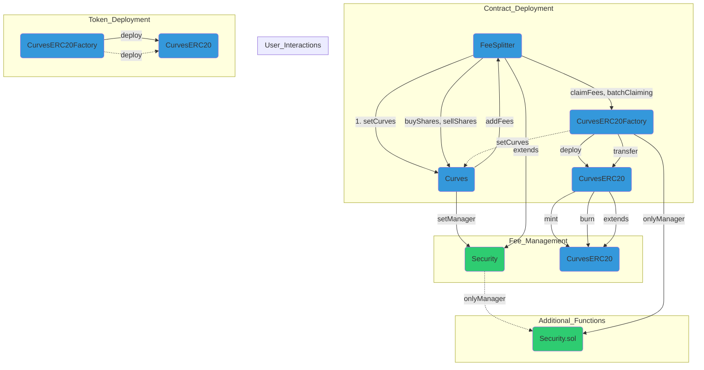

  <h1> Curves Contest</h1>
  <h5>The first interoperable SocialFi protocol. Buy, sell and trade SocialFi tokens across a universe of dapps.</h5>
  

## Index
- [Index](#index)
- [1. A Comprehensive Overview](#1-a-comprehensive-overview)
- [2. The main contracts and the analyses of them](#2-the-main-contracts-and-the-analyses-of-them)
  - [Curves.sol Contract:](#curvessol-contract)
- [3. Curves Architecture](#3-curves-architecture)
- [4. Possible Systemic Risks](#4-possible-systemic-risks)
- [5. Insights and Learning from this project](#5-insights-and-learning-from-this-project)
- [6. Future Security Aproach Recommendation](#6-future-security-aproach-recommendation)
- [7. Test analysis](#7-test-analysis)
- [8. Monitoring Recommendations](#8-monitoring-recommendations)

**The Process and Steps We Followed for Codebase Evaluation:** Our approach to analyzing the source code of the Curves contest was to simplify the information provided by the protocol, using a variety of diagrams to visually clarify the project's key contracts and break down each important part of these contracts. We identified the fundamental concepts and employed simpler language to explain the functionality and goals of the project team and understand as well the purpuse of this audit.This enhances understanding for developers, security researchers, and users alike. Furthermore, we organized the information logically into separate sections, each with identifying titles, to provide a clear overall picture of the subject. Our primary goal was to make the information more accessible and easy to understand.

## 1. A Comprehensive Overview
**Curves** is a SocialFi protocol aimed at enabling users to buy, sell, and trade SocialFi tokens within a decentralized application ecosystem. Its interoperability and specific features, such as token export to ERC20 format, presale, and fee model, set it apart.

## 2. The main contracts and the analyses of them
> The main contract of this audit is the following:

### Curves.sol Contract:
The `Curves.sol` contract inherits from other contracts that provide functionalities and security measures. In its structure, `Curves.sol` is an extension of OpenZeppelin library contracts, including `Ownable.sol` to manage contract ownership and `ERC20.sol` to implement the ERC-20 token standard. Additionally, it utilizes custom contracts such as `FeeSplitter.sol` for fee distribution and claiming, and `Security.sol` to establish security measures like access restrictions and the definition of owners and managers. The interconnection of these contracts provides the necessary infrastructure for the creation, management, and operation of custom tokens in the `Curves` system.

**Key Functionality:**
  1. **Token Export to ERC20:**
     - Users can transfer their Curves tokens to the ERC20 format, enhancing interoperability.

  2. **Referral Fee Implementation:**
     - Protocols built on Curves can earn a percentage of all user transaction fees, providing additional incentives.

  3. **Presale Feature:**
     - A presale phase is incorporated to address issues related to frontrunning during token launches.

  4. **Token Holder Fee:**
     - A fee distribution model is introduced, rewarding token holders and encouraging long-term retention.
  
  5. **Dynamic Pricing Model:** The pricing model within Curves is based on a mathematical formula that calculates prices based on the supply and demand of tokens, providing a dynamic and efficient market mechanism.
  
  6. **Token Minting and Deployment:** The contract facilitates the minting and deployment of ERC20 tokens associated with Curves subjects, allowing for customization of token metadata and attributes.

**Utility:** Curves enhances functionality and integration into the financial ecosystem by providing innovative features and fostering active, long-term user engagement. Interoperability and the ability to generate additional income for associated protocols are key aspects of its utility.

## 3. Curves Architecture
> this is the arquitecture the curves based on the doc provided by the team in the discord chat and how the contracts are connected:

## 4. Possible Systemic Risks
The Curves contract and its integrations present some critical aspects that require special attention to avoid potential systemic risks in the protocol. The manipulation of prices through the [getPrice](https://github.com/code-423n4/2024-01-curves/blob/main/contracts/Curves.sol#L180) method must be rigorously audited and tested to prevent inefficiencies in token valuation.

Ensuring the proper distribution of fees to token holders is a crucial component to maintain trust and participation in the protocol,any errors in the distribution logic could negatively affect the perception of the protocol and user participation. Furthermore, the reliance on external contracts, such as OpenZeppelin, introduces the need to closely monitor updates and changes in these contracts to avoid incompatibilities or unexpected failures, it is important to note that the protocol uses version [4.9.3](https://github.com/code-423n4/2024-01-curves/blob/main/package.json#L31) of OpenZeppelin, while the latest available version is [5.0.1](https://github.com/OpenZeppelin/openzeppelin-contracts/releases/tag/v5.0.1) it is highly recommended to upgrade to the latest version to benefit from security improvements.

Additionally, it is crucial to highlight that the Curves protocol currently does not implement tests for invariants or fuzzing, these must be standard practices in smart contract development to ensure robustness and resistance to possible exploits or vulnerabilities. The absence of invariants and fuzzing tests may introduce uncertainty into the security of the protocol, as the continuous compliance with certain critical properties is not systematically verified.

The incorporation of invariants tests, which verify that certain conditions always remain true, and fuzzing tests, which subject the contract to unexpected or extreme inputs, can be crucial to identify and address potential weaknesses in the contract logic before deployment in a production environment. 

It is strongly recommended to take additional precautions in sensitive functions such as withdraw, considering the possibility of implementing extra layers of security, such as using OpenZeppelin librarie like ReentrancyGuard,this additional measure would enhance the contract's robustness against potential reentrancy attacks.

## 5. Insights and Learning from this project
While we review this contest we found that curves introduces innovative features, although inspired by the [Friendtech](https://www.friend.tech/) protocol. Curves sets itself apart by incorporating unique and enhanced characteristics to provide a distinctive experience within the SocialFi ecosystem. Key Features include:

- **Token Export to ERC20:** Users can transfer their Curves tokens to the ERC20 format to enhance interoperability.
  
- **Referral Fee Implementation:** Protocols built on Curves can earn a percentage of all user transaction fees.
  
- **Presale Functionality:** A presale phase is incorporated to address issues related to frontrunning during token launches.
  
- **Token Holder Fee Model:** A fee distribution model is introduced, rewarding token holders and encouraging long-term retention.

These additions set Curves apart by providing a unique and improved experience compared to its inspiration from Friendtech.

## 6. Future Security Aproach Recommendation
What the project can add in the understanding of security:

- After the Code4rena audit is completed and the project is live, I recommend the audit process to continue, projects like [immunefi](https://immunefi.com/) and [Code4rena Blue](https://code4rena.com/how-it-works/blue) program.

- We also recommend taking the time to document in detail whatever you intend to do and following best practices such as using [NatSpec](https://docs.soliditylang.org/en/v0.8.15/natspec-format.html) in functions, this is not only for future code reviews but also for better readability and understanding of your project.

## 7. Test analysis
The audit scope of the contracts to be reviewed is 100% but we recommended to make invariants and fuzzing tests in the future to increase the safety of the project.

## 8. Monitoring Recommendations
While code reviews help in identifying code-level issues in the current implementation and potentially the code deployed in production, the Cuves team is encouraged to consider incorporating monitoring activities in the production environment. Ongoing monitoring of deployed contracts helps identify potential threats and issues affecting production environments. With the goal of providing a complete security assessment, the monitoring recommendations section raises several actions addressing trust assumptions and out-of-scope components that can benefit from on-chain monitoring.

### Time spent:
28 hours